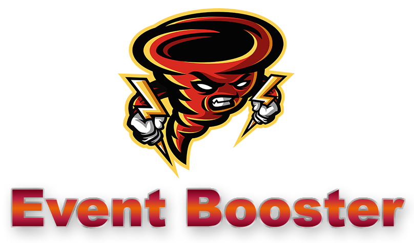

___
## Performance based user interactions and event tracking


```js
 const eventBooster = new EventBooster({ 
            withoutEvents: [],
            withCallbackAction: {
                load: function () {

                },
                cut: function () {

                },
                copy: function () {
                    
                },
                paste: function () {
                    
                },
                scroll: function () {
                    
                },
                click: function () {
                    
                },
                dblclick: function () {
                    
                },
                contextmenu: function () {
                    
                }
            },
            storageRootSettings: {
                browserType: true,
                setUserToken: '1ef-qweeglkf-qwet'
            },
            storageSettings: {
                innerText: true,
                browserType: true,
                withAttributes: true,
            }
        });
        const storage = eventBooster.getAllStorage();
```


