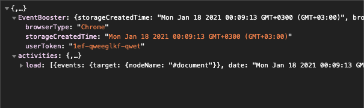

___
## Performance based user interactions and event tracking
<br>
<br>

## Getting for NPM
> npm i event-booster
### Trackable events
* load (Page load)
* cut
* copy
* paste
* scroll
* click
* dblclick
* contextmenu
<br>
<br>

### API's
Key | Description | Example | Type
------------ | ------------- | -- | --
withoutEvents | Doesn't load activities you don't want to run | `['load', 'cut']` | Array
withCallbackAction | Executes callback after the event runs | `load: function () {},` | function
storageRootSettings | Optional settings of root storage | `browserType: true,` | Object
storagesettings | Optional settings of storage | `withAttributes: true,`  | Object

<br>
<br>
### Key Settings
* storageRootSettings:

Key | Description
------------ | --------
browserType | Browser name of the storaged user
setUserToken | Special key or token of the storaged user
<br>
<br>
* storageSettings:

Key | Description
------------ | --------
innerText | When an events is done, it store the texts.
withAttributes | When an events is done, it store the tag attributes.

<br>
<br>

### Example Code
```js
 const eventBooster = new EventBooster({ 
            withoutEvents: [],
            withCallbackAction: {
                load: function () {

                },
                cut: function () {

                },
                copy: function () {
                    
                },
                paste: function () {
                    
                },
                scroll: function () {
                    
                },
                click: function () {
                    
                },
                dblclick: function () {
                    
                },
                contextmenu: function () {
                    
                }
            },
            storageRootSettings: {
                browserType: true,
                setUserToken: '1ef-qweeglkf-qwet'
            },
            storageSettings: {
                innerText: true,
                withAttributes: true,
            }
        });
        const storage = eventBooster.getAllStorage();
```
<br>

# Output

